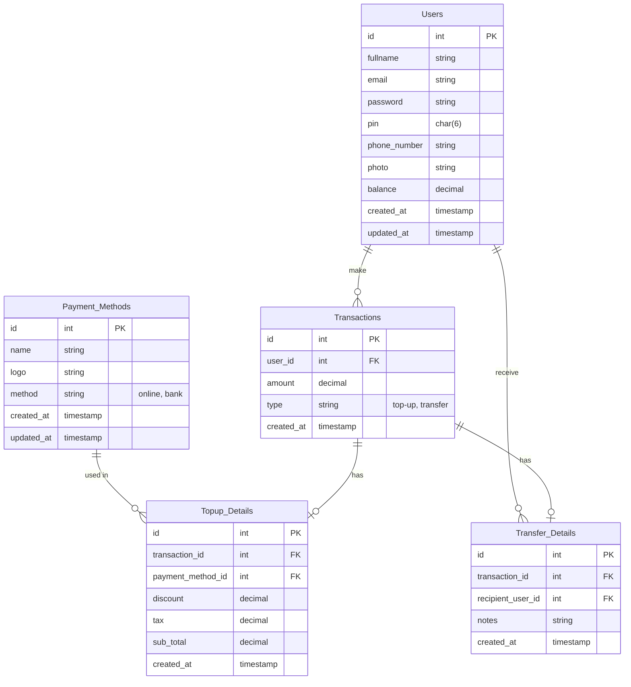

```mermaid
erDiagram
    Users {
        id int PK
        fullname string
        email string
        password string
        pin char(6)
        phone_number string
        photo string
        balance decimal
        created_at timestamp
        updated_at timestamp
    }
    Transactions {
        id int PK
        user_id int FK
        amount decimal
        type string "top-up, transfer"
        created_at timestamp
    }
    Payment_Methods {
        id int PK
        name string
        logo string
        method string "online, bank"
        created_at timestamp
        updated_at timestamp
    }
    Topup_Details {
        id int PK
        transaction_id int FK
        payment_method_id int FK
        discount decimal
        tax decimal
        sub_total decimal
        created_at timestamp
    }
    Transfer_Details {
        id int PK
        transaction_id int FK
        recipient_user_id int FK
        notes string
        created_at timestamp
    }

    Users ||--o{ Transactions : make
    Users ||--o{ Transfer_Details : receive
    Payment_Methods ||--o{ Topup_Details : "used in"
    Transactions ||--o| Topup_Details : has
    Transactions ||--o| Transfer_Details : has
```